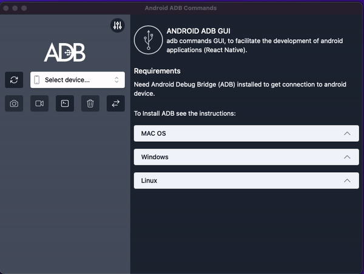

 Taury-Android-ADB-GUI
----
<p align="center">

</p>

### EN
adb commands GUI, to facilitate the development of android applications (React Native).

##### This software is still in an early stage of development. Check out the issues, and feel free to contribute!

## Summary
Using android packages, we can get the package of our application and using the commands we can open, close, restart and delete application data.


## Features 
* [X] Get list of system packages
* [X] Find Package
* [X] Select package
* [X] Open the application
* [X] Close app Clear data
* [X] Wipe data and reboot app
* [] Configure adb location
* [] Menu to start emulator
* [] Clear package selection

## Requerimients

### * ADB 
- Install ADB (see the intructions by clicking on your OS below):
  <p>
  <details>
  <summary>LINUX</summary>

  - Install *Android platform tools* on your PC :

  Debian Base:
  ```bash
  $ sudo apt install android-sdk-platform-tools
  ```
  Arch-Linux Base:
  ```bash
  $ sudo pacman -S android-tools
  ```
  Red Hat Base:
  ```bash
  $ sudo yum install android-tools
  ```
  OpenSUSE Base:
  ```bash
  $ sudo zypper install android-tools
  ```
  </details>
  </p>

  <p>
  <details>
  <summary>MAC OS</summary>

  - Install [Homebrew](https://brew.sh/)
  - Install *Android platform tools*
    ```bash
    $ brew install android-platform-tools
    ```
  </details>
  </p>

  <p>
  <details>
  <summary>WINDOWS</summary>

  - Download [android platform tools](https://dl.google.com/android/repository/platform-tools-latest-windows.zip) and unzip it somewhere. [Add the folder to your PATH](https://www.architectryan.com/2018/03/17/add-to-the-path-on-windows-10/).

  - [Install USB drivers for your device](https://developer.android.com/studio/run/oem-usb#Drivers)
  - Check your device is detected:
    ```batch
    > adb devices
    ```
  </details>
  </p>

### ES
ADB comandos GUI, Para facilitar el desarrollo de aplicaciones android(React Native).

##### El programa esta en desarrollo. Revisa o crea issues, y si puedes contribuye!

## Descripcion
Usando la lista de paquetes de nuestro dispositivo android y selecionando el paquete de nuestra aplicacion, podremos abrir, cerrar, reiniciar y eliminar datos de la aplicacion desde la interfaz. 


## Funciones 
* [X] Obtener sistema de paquetes
* [X] Buscar paquete
* [X] Seleccionar paquete
* [X] Abrir la aplicacion
* [X] Cerrar aplicacion Limpiar datos
* [X] Limpiar datos y reiniciar de la aplicacion
* [] Configurar la ubicacion del adb
* [] Menu para iniciar emulador
* [] Limpiar selecion de paquete

## Requisitos

### * ADB
- Instale ADB (consulte las instrucciones haciendo clic en su sistema operativo a continuación):
  <p>
  <details>
  <summary>LINUX</summary>

  - Instala *Android platform tools* en tu PC :

  Debian Base:
  ```bash
  $ sudo apt install android-sdk-platform-tools
  ```
  Arch-Linux Base:
  ```bash
  $ sudo pacman -S android-tools
  ```
  Red Hat Base:
  ```bash
  $ sudo yum install android-tools
  ```
  OpenSUSE Base:
  ```bash
  $ sudo zypper install android-tools
  ```
  </details>
  </p>

  <p>
  <details>
  <summary>MAC OS</summary>

  - Instala [Homebrew](https://brew.sh/)
  - Instala *Android platform tools*
    ```bash
    $ brew install android-platform-tools
    ```
  </details>
  </p>

  <p>
  <details>
  <summary>WINDOWS</summary>

  - Descarga [android platform tools](https://dl.google.com/android/repository/platform-tools-latest-windows.zip) y descromprime el en algun lugar. [Agrega el fólder con la ruta](https://www.architectryan.com/2018/03/17/add-to-the-path-on-windows-10/).

  - [Instalar los drivers USB para tu dispositivo](https://developer.android.com/studio/run/oem-usb#Drivers)
  - Revisa si tu dispositivo Android es detectado:
    ```batch
    > adb devices
    ```
  </details>
  </p>


## Screenshots
 <p align="center">

</p>
