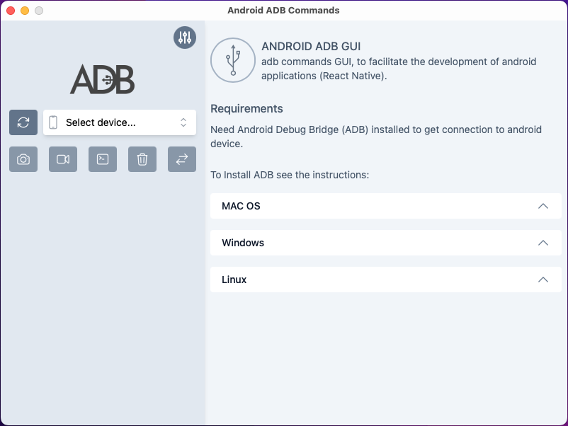
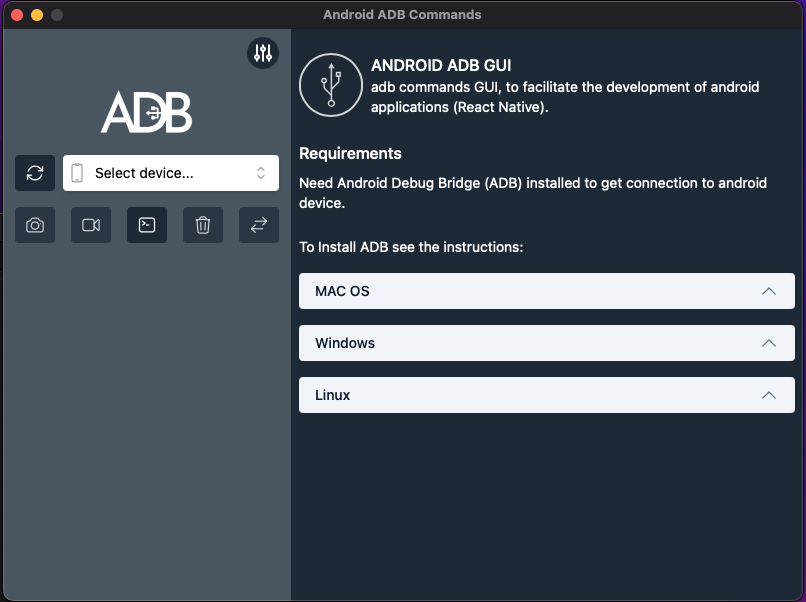
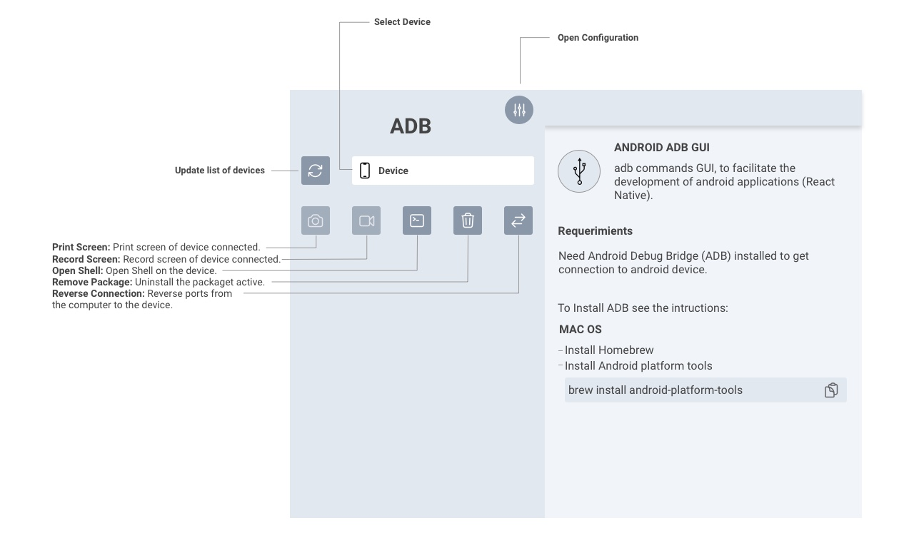
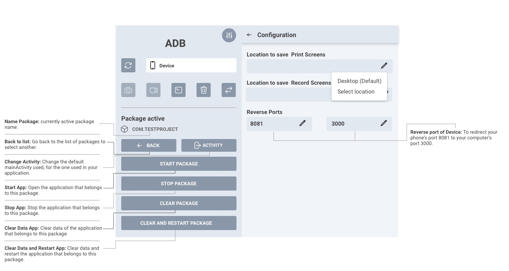

 Taury-Android-ADB-GUI
----
<p align="center">

</p>


### ENGLISH

 <p align="center">

</p>
AIDB commands GUI, to facilitate the development of android and IOS applications (React Native).

##### This software is still in an early stage of development. Check out the issues, and feel free to contribute!

## Summary
Using android packages, we can get the package of our application and using the commands we can open, close, restart and delete application data.

#### Start development
Is necessary [install the prerequisites of **tauri**](https://tauri.app/v1/guides/getting-started/prerequisites) to prepare the  development environment. 

* Now clone the repository and install the dependencies with the command:


```  
yarn install
```
 or 

``` 
  npm install 
```


* Now you can run the following command in your terminal to start a  **development build** :

 
```  
yarn tauri dev
```
or 

``` 
 npm tauri dev
```

----

* To **build** and bundle the application into a single executable simply run the following command:

```  
yarn tauri build
```
or 

``` 
 npm tauri build
```


## Features 
* [X] Get list of system packages
* [X] Find Package
* [X] Select package
* [X] Open the application
* [X] Close app Clear data
* [X] Wipe data and reboot app
* [X] Uninstall selected packege
* [X] Reverse ports options and action (React Native)
* [ ] Open terminal Shell in the device
* [ ] Menu to start emulator
* [ ] Clear package selection
* [ ] Capture Screen
* [ ] Record Screen

## Requerimients

### * ADB 
- Install ADB (see the intructions by clicking on your OS below):
  <p>
  <details>
  <summary>LINUX</summary>

  - Install *Android platform tools* on your PC :

  Debian Base:
  ```bash
  $ sudo apt install android-sdk-platform-tools
  ```
  Arch-Linux Base:
  ```bash
  $ sudo pacman -S android-tools
  ```
  Red Hat Base:
  ```bash
  $ sudo yum install android-tools
  ```
  OpenSUSE Base:
  ```bash
  $ sudo zypper install android-tools
  ```
  </details>
  </p>

  <p>
  <details>
  <summary>MAC OS</summary>

  - Install [Homebrew](https://brew.sh/)
  - Install *Android platform tools*
    ```bash
    $ brew install android-platform-tools
    ```
  </details>
  </p>

  <p>
  <details>
  <summary>WINDOWS</summary>

  - Download [android platform tools](https://dl.google.com/android/repository/platform-tools-latest-windows.zip) and unzip it somewhere. [Add the folder to your PATH](https://www.architectryan.com/2018/03/17/add-to-the-path-on-windows-10/).

  - [Install USB drivers for your device](https://developer.android.com/studio/run/oem-usb#Drivers)
  - Check your device is detected:
    ```batch
    > adb devices
    ```
  </details>
  </p>

### ESPAÑOL
ADB comandos GUI, Para facilitar el desarrollo de aplicaciones android(React Native).

##### El programa esta en desarrollo. Revisa o crea issues, y si puedes contribuye!

## Descripcion
Usando la lista de paquetes de nuestro dispositivo android y seleccionando el paquete de nuestra aplicación, podremos abrir, cerrar, reiniciar y eliminar datos de la aplicación desde la interfaz. 


#### Start development
Es necesario [instalar los requisitorios de **tauri**](https://tauri.app/v1/guides/getting-started/prerequisites) para preparar el ambiente de desarrollo. 

* Luego puedes clonar el repositorio e instalar las dependencias con el comando:

```  
yarn install
```
 ó

``` 
  npm install 
```


* Ya puedes ejecutar en tu terminal el siguiente comando para iniciar la aplicación en modo desarrollo:
 
```  
yarn tauri dev
```
 ó

``` 
 npm tauri dev
```

----

* Para compilar la aplicación para producción en un solo archivo simplemente ejecuta el comando:

```  
yarn tauri build
```
 ó 

``` 
 npm tauri build
```


## Funciones 
* [X] Obtener sistema de paquetes
* [X] Buscar paquete
* [X] Seleccionar paquete
* [X] Abrir la aplicación
* [X] Cerrar aplicación Limpiar datos
* [X] Limpiar datos y reiniciar de la aplicación
* [X] Desinstalar la aplicacion activa
* [X] Opciones y accion de reversa de puertos( Mas utilizado en React Native)
* [ ] Abrir terminal Shell en el dispositivo
* [ ] Capturar imagen de la pantalla
* [ ] Grabar pantalla del dispositivo
* [ ] Configurar la ubicación del ejecutable adb
* [ ] Menú para iniciar emulador
* [ ] Limpiar la selección de paquete

## Requisitos

### * ADB
- Instale ADB (consulte las instrucciones haciendo clic en su sistema operativo a continuación):
  <p>
  <details>
  <summary>LINUX</summary>

  - Instala *Android platform tools* en tu PC :

  Debian Base:
  ```bash
  $ sudo apt install android-sdk-platform-tools
  ```
  Arch-Linux Base:
  ```bash
  $ sudo pacman -S android-tools
  ```
  Red Hat Base:
  ```bash
  $ sudo yum install android-tools
  ```
  OpenSUSE Base:
  ```bash
  $ sudo zypper install android-tools
  ```
  </details>
  </p>

  <p>
  <details>
  <summary>MAC OS</summary>

  - Instala [Homebrew](https://brew.sh/)
  - Instala *Android platform tools*
    ```bash
    $ brew install android-platform-tools
    ```
  </details>
  </p>

  <p>
  <details>
  <summary>WINDOWS</summary>

  - Descarga [android platform tools](https://dl.google.com/android/repository/platform-tools-latest-windows.zip) y descomprime el en algún lugar. [Agrega el fólder con la ruta](https://www.architectryan.com/2018/03/17/add-to-the-path-on-windows-10/).

  - [Instalar los drivers USB para tu dispositivo](https://developer.android.com/studio/run/oem-usb#Drivers)
  - Revisa si tu dispositivo Android es detectado:
    ```batch
    > adb devices
    ```
  </details>
  </p>


## Screenshots

 <p align="center">

</p>
 <p align="center">

</p>

####  App details UI
 
 <p align="center">

</p>
  <p align="center">

</p>

